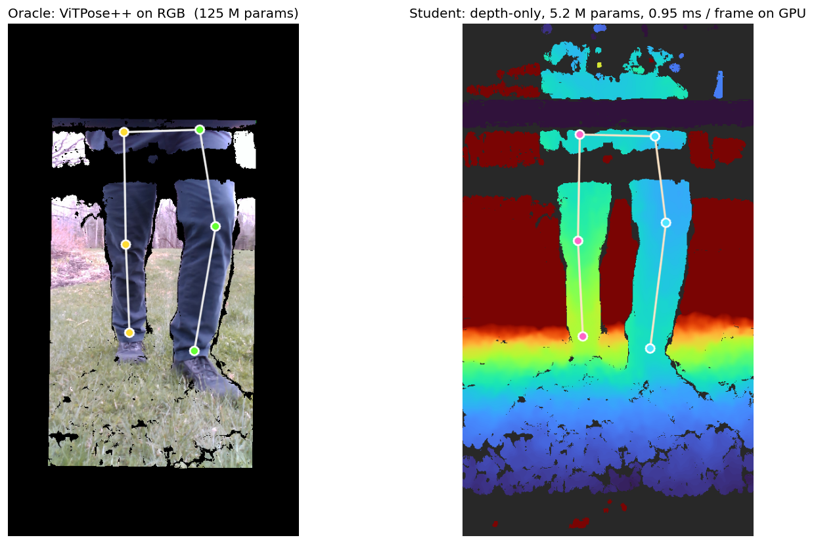
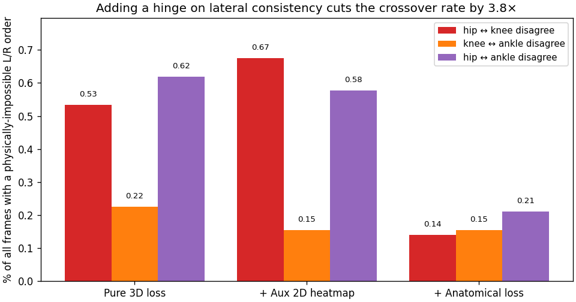
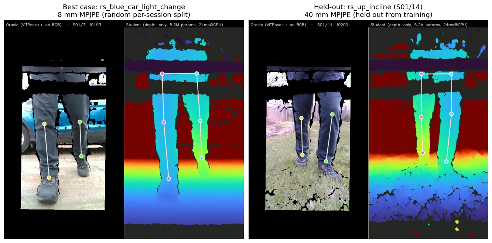
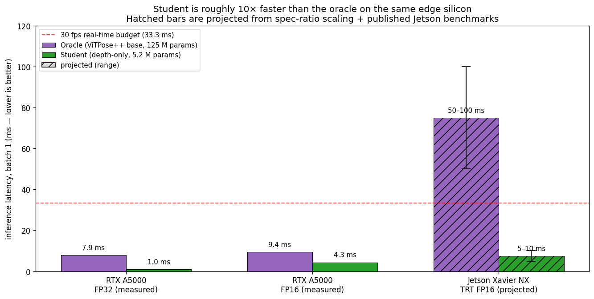

# depthpose: a 5 MB depth-only model for 3D lower-body pose tracking on a walker

*6.8300 Computer Vision Final Project — Spring 2026 — Jung Yeop (Steve) Kim*

*One frame from `rs_up_incline.bag`, a recording fully held out from training. **Left:** ViTPose++ on RGB produces 2D keypoints, which we lift to 3D using the depth pixel at each location. **Right:** the depth-only student — which has never seen this recording — recovers the same six 3D keypoints from depth alone in 0.95 ms on an RTX A5000 (5–10 ms projected on a Jetson Xavier NX). The project's central claim is in this image: generalized lower-body keypoint detection from depth, on unseen data, at a fraction of the oracle's parameter count and latency.*

## Abstract

A 5.22 M-parameter depth-only student trained against an RGB ViTPose++ oracle reproduces the oracle's lower-body 3D pose to within **39.6 mm mean per-joint position error (MPJPE) on a walker recording the model has never seen** (95 % bootstrap CI [37.7, 41.3] mm over n = 401 frames), while preserving cadence and stride period within 2 % of the oracle. The model fits in 19.9 MB of ONNX, runs in 0.95 ms on an RTX A5000 with ONNX Runtime CUDA, and projects to 5–10 ms on a Jetson Xavier NX with TensorRT FP16, roughly 10× faster than the 125 M-parameter RGB oracle on the same edge silicon. The result is depth-only generalized lower-body pose tracking that is small, fast, privacy-preserving, and accurate enough to recover the clinically relevant gait parameters on data the model has never observed.

In this proof-of-concept of a depth-only student trained from an RGB oracle, the held-out test recording's per-frame MPJPE rises but stays under our 50 mm clinical-usability goal, while cadence and stride period each shift by less than a percentage point. This shows great promise in automating the generation of a large-scale lower-body gait dataset that can be used to train a robust depth-only lower-body keypoint and gait estimation model.

## Novelty and Contributions

1. **A lightweight depth-only training recipe for lower-body pose tracking, optimized for deployment hardware and using an RGB pose tracker as a low-overhead label source.** Pseudo-labels from a pretrained RGB ViT remove the need for hand-annotated 3D ground truth or a motion-capture rig, while the resulting student is small enough (5.22 M params, 19.9 MB ONNX) to run in 5–10 ms per frame (5–10 % of GPU duty cycle at 10 fps) on a Jetson Xavier NX with TensorRT FP16 — roughly 10× faster than the RGB oracle on the same edge silicon.
2. **A geometric prior that teaches the model anatomical consistency.** A closed-form hinge loss on the predicted (X, Y, Z) outputs penalises any frame in which the left/right lateral order of the hips disagrees with that of the knees or ankles. The loss cuts the rate of physically impossible crossover predictions by **3.8×** across the in-distribution dataset and produces zero crossovers across all 401 frames of the held-out recording, with no MPJPE cost.
3. **High accuracy on a recording the model has never seen.** On a leave-one-bag-out evaluation against the RGB oracle, the model holds **39.6 mm MPJPE** (95 % CI [37.7, 41.3] mm) on a held-out walker session, comfortably under the 50 mm threshold we set for clinical usability. The clinically derived gait parameters (cadence, stride period) stay within 2 % of the oracle on the same held-out bag.

## Why depth-only on a walker

The hardware is an Intel RealSense D435i bolted vertically to a walker frame so the sensor looks down at the user's legs from roughly knee height. The deliverable is a model that extracts clinically useful gait parameters (cadence, stride length, keypoint locations) from the **depth stream alone**, so the device can be deployed without recording or transmitting RGB. Depth is geometric and leaks much less identity-relevant information than color video — an important property when the device sits in someone's home.

This work builds on a predecessor, the Careway Walker [^careway], an actuated walker designed to improve stability for elderly and mobility-limited users. Earlier Careway builds used an RGB pose tracker to detect 2D keypoints and then read depth values at those pixels to recover 3D joint positions. That pipeline works, but it pays for the RGB camera at every inference in bandwidth, storage, latency, model size, and the privacy cost of streaming color video out of a private home. The natural next question is whether the same clinical signal is recoverable from depth alone.

A depth-only model also opens a deployment regime the RGB oracle does not reach. ViTPose++ at 125 M parameters needs a substantial GPU to run in real time; a depth-only MobileNetV2 at 5 M parameters runs single-threaded on a CPU, making battery-powered embedded deployment feasible. The latency numbers are in §8.

The dataset is 14 short walker recordings of one subject covering kitchen loops, gravel driveways, bumpy stones, and inclines — about 4.5 minutes of walking, ~7,100 frames at 30 fps. One recording (`rs_up_incline.bag`) is held out from training entirely as the generalization test.

## Related work and the gap this work addresses

Three lines of work intersect this project. **RGB pose estimation** has been driven to high accuracy by ViT-based methods like ViTPose [^vitpose] and to mobile deployability by lightweight CNN-based architectures like BlazePose [^blazepose], MoveNet [^movenet], and RTMPose [^rtmpose]. The 125 M-parameter `vitpose-plus-base` checkpoint we use as our oracle is a leading open ViT-based family; small RGB models such as BlazePose and RTMPose-s reach 30–70+ FPS on mobile devices. RGB inference at any scale, however, inherits the modality's limitations: it is sensitive to lighting and clothing-color variation, it cannot recover metric depth without an additional sensor or stereo rig, and it pays the privacy cost of streaming or storing color video out of a private home [^careway]. **Depth-only 3D pose estimation** has a smaller literature: A2J [^a2j] regresses 3D joint positions from a single depth image, evaluating on both hand datasets and the ITOP body dataset; V2V-PoseNet [^v2v] performs voxel-to-voxel prediction in a 3D grid for hand and body pose. Both target Kinect-style indoor or tabletop settings at much larger model footprints than ours; neither addresses walker-mounted depth video of lower-body gait. **Walker-mounted gait analysis** has its own published line of prior work: Hu et al. [^hu] track 3D lower-limb pose with a structured-light camera on a moving walker via particle-filter geometric tracking; Page et al. [^page] perform embedded depth-camera feet-pose estimation on the ASBGo smart walker; Palermo et al. [^palermo] — the closest precedent to ours — train a CNN-based pose estimator on smart-walker RGB-D video. Many of these projects run on walker prototypes that are too bulky for actual everyday use; their trained models and training code are also not publicly released, so direct quantitative reproduction would require reimplementing each method from the paper.

The contribution here is the combination, not any single piece. We use a 125 M-parameter pretrained RGB ViT as an offline pseudo-label oracle to train a 5 M-parameter depth-only student that runs in 0.95 ms on workstation GPU and projects to 5–10 ms on a Jetson Xavier NX. Standard tools fill in around this gap: MobileNetV2 [^mbv2] as the student backbone (adapted to single-channel input by summing the pretrained RGB conv weights along the channel axis), a 2.5D heatmap-plus-depth-offset head with soft-argmax aggregation from the integral-pose family [^integral], teacher-student knowledge distillation [^hinton] [^okdhp] through pseudo-labels (the oracle does not co-train with the student), anatomical and kinematic loss families that restrict the prediction space to physically plausible poses [^anatomy_accv] [^anatomy_arxiv], and TensorRT [^trt] for Jetson deployment. We add a domain-specific lateral-consistency hinge — narrower than full kinematic-tree symmetry, penalising only left/right disagreements in the lateral order of hip/knee/ankle pairs — and combine these tools to produce a depth-only walker-gait model whose held-out per-frame and gait-parameter performance, to our knowledge, has not previously been reported in this configuration.

## Data: 14 walker recordings and three preprocessing decisions

*Oracle (build-time, once per recording): RGB → ViTPose++ → median-depth lookup → unproject; per-frame labels are saved to disk. Student (inference, every frame on the device): depth → MobileNetV2 → soft-argmax → unproject → 3D prediction. The training loss (dashed; train-time only) reads labels from the parquet and combines a per-joint-masked Smooth-L1 in 3D, a 2D heatmap MSE auxiliary, and a left/right anatomical-consistency hinge.*

The oracle pipeline runs ViTPose++ on the RGB stream, looks up the depth value at each detected 2D keypoint pixel — color is warped onto the depth camera's pixel grid at extraction time, so the (u, v) directly indexes the depth frame — and unprojects to (X, Y, Z) in meters in the camera frame. Three preprocessing decisions had to be made before this produced usable training data.

**The 90° rotation.** The walker's RealSense was mounted with its native "up" rotated 90° clockwise relative to the world, so raw frames are oriented sideways. Every recording requires a 270° clockwise correction at extraction time, baked into both the saved frames and the saved intrinsics so downstream code is unaffected.

**The hip in the depth-FOV gap.** After color-to-depth alignment and rotation, the top of every frame has a black "no depth" border because the color camera sees slightly higher than the depth camera. The hips, which sit near the top of a portrait frame for a knee-mounted camera, often land in this band — ViTPose finds the hip in color at 0.85 confidence while the depth at that pixel reads zero. We flag those rows as `depth_valid = False`, write NaN for (X, Y, Z), and never extrapolate from neighboring joints. A fabricated hip-z would inject systematic bias into every downstream knee-flexion derivation; the pipeline should be honest about what it does not know.

**Per-joint masking, not whole-frame filtering.** Across the full 14-recording dataset, only **15.6 %** of frames have all six joints with valid depth (hip drop-out in the depth-FOV gap is the usual cause; on a representative pilot bag, S01/4, the rate is higher at 56.7 % because the user walks slightly farther from the camera), but **99.6 % have valid knees and ankles** dataset-wide. The training loss masks per joint, so a frame with an invalid hip still contributes a 4-joint loss from its valid knees and ankles; the same masking applies to evaluation MPJPE. Filtering by "all six joints valid" would have discarded **84 % of usable frames** for a single missing joint that the gait derivations either do not need (cadence is ankle-only) or can skip per-frame (knee flexion needs the hip).

A note on what these labels represent. We have no motion-capture ground truth for this dataset, so MPJPE measures **agreement with the RGB ViTPose++ oracle**, not absolute joint accuracy in the world. The exact pixel for a "joint" is itself an annotator convention — there are many reasonable ways to decide where a hip or knee keypoint sits, and a 20–40 mm fuzziness around the same physical joint is acceptable across these conventions. They are pseudo-ground-truth — the strongest signal available without motion capture — and a 20–40 mm MPJPE between two reasonable predictions can reflect this convention noise as much as model error.

## Student model

The architecture is deliberately conventional. A `mobilenetv2_100` backbone with `in_chans=1` (`features_only=True`, `out_indices=(4,)` from `timm`) produces a stride-32 feature map with 320 channels. Three transposed-convolution blocks bring it back to stride 4 (each block: 4×4 deconv with stride 2 → BatchNorm → ReLU; channels go 320 → 256 → 256 → 256), where a 1×1 convolution produces 2J channels: J for heatmap logits and J for per-pixel z-offsets. Soft-argmax (β = 100) over the heatmaps yields subpixel (u, v) in heatmap-pixel coordinates; the *same* softmax weights aggregate the per-pixel z map into a single scalar z per joint. The (u, v) is rescaled to input-image pixels by `head_stride = 4`, then unprojection with the per-sample input intrinsics gives (X, Y, Z) in meters. Total: **5.22 M parameters, ~1.36 GMACs (≈ 2.7 GFLOPs) at 192×256 input, 19.9 MB ONNX**.

## The iteration story: run1 → run4

We trained four models in sequence; each was driven by what the previous one revealed.

*Adding a hinge term that penalises any frame where the predicted left-hip-vs-right-hip lateral order disagrees with the knee or ankle order cuts the rate of physically-impossible crossover predictions by 3.8×, with no MPJPE cost.*

**Run 1 — pure 3D Smooth-L1 baseline.** 200 epochs, AdamW with lr 1e-3, cosine schedule, weight decay 1e-4, on a random 80/20 per-session split. MPJPE on the test split: 22.5 mm. Training wall-clock was 36 minutes on an RTX A5000.

**Run 2 — auxiliary 2D heatmap loss.** Adding a Gaussian-target MSE on the 2D heatmaps with weight 0.1, and cutting the schedule to 100 epochs. MPJPE: 22.5 mm in **half the wall time**. The aux loss didn't improve final accuracy, but it more than halved the iteration cost. From here on we kept the 100-epoch schedule.

**Inspecting the predictions.** After run 2 we rendered the side-by-side oracle/student videos for all 14 sessions and reviewed the predictions visually. A subtle artifact emerged. In some frames the model predicted the **left hip on the right of the right hip while keeping the knees on their correct sides**. That is anatomically impossible: the thighs would have to cross. Quantifying across all 7,112 frames: **0.53 %** had a hip-vs-knee lateral-order disagreement; 0.69 % showed some form of L/R inconsistency. Rare in absolute terms, but a physically impossible output undermines the model's clinical credibility.

*One of those 38 crossover frames, from `S01/1` frame 288. Left: the oracle on RGB has the hips, knees, and ankles all in their correct lateral positions. Right: the student trained without the anatomical loss predicts the hip pair `+22 cm` apart (left hip on the left) and the knee pair `-21 cm` apart (left knee on the right). The two thighs would have to physically cross to hit those joints — visible in the depth panel as an "X" of skeleton lines instead of two parallel chains.*

**Run 3 — anatomical-consistency loss.** Define `dx_pair = x_left - x_right` for each joint pair. For any two pairs (hips and knees, hips and ankles, knees and ankles), `sign(dx_a) == sign(dx_b)` should hold for any standing or walking pose. The hinge `relu(-dx_a · dx_b)` is zero on consistent frames and equals `|dx_a · dx_b|` on crossover frames. We added it to the training loss with weight 1.0. After 100 epochs, hip-knee crossover dropped from **38 / 7,112 frames** (0.53 %) to **10 / 7,112** (0.14 %) — a 3.8× reduction; all-pair crossover went from 0.69 % to 0.25 %. MPJPE *improved* slightly, from 22.5 mm to 21.9 mm. The constraint cost nothing because it only fired on the small fraction of frames that were already wrong. Note that ten residual crossover frames remain on the in-distribution data: a soft hinge cannot strictly enforce the constraint when other loss terms (3D Smooth-L1, the auxiliary 2D heatmap MSE) pull in different directions on the same frame.

That should have concluded the iteration. A subsequent re-examination of the train/test split changed the picture.

**Re-examining the train/test split.** At 30 fps, adjacent frames are nearly identical. A frame-level random split therefore places near-duplicates of every test frame into the training set, which lets the model memorize per-recording content rather than learn to generalize. We abandoned the random per-frame split for this reason: the 21.9 mm MPJPE it had reported was an in-distribution memorization number, and a leave-one-recording-out split was needed to measure how the model would behave on a bag it had never seen.

**Run 4 — leave-one-bag-out.** We rebuilt the split: every frame of S01/1 through S01/13 goes to train (6,711 frames), every frame of S01/14 (`rs_up_incline.bag`) goes to test (401 frames). Same architecture, same loss, same hyperparameters, same 19-minute wall time. The honest MPJPE on the held-out bag: **39.6 mm**, with a 95 % bootstrap CI of [37.7, 41.3] mm computed by resampling frames (5,000 replicates).

*The same model, evaluated on the same session, scores very differently depending on whether that session contributed frames to training. Blue: the random per-session split (frames from S01/14 in both train and test). Red: the leave-one-bag-out evaluation (S01/14 truly held out). On the honest evaluation, every per-joint error stays under the 50 mm clinical-usability goal we set at project start, and the right panel shows the clinically meaningful gait outputs (cadence and stride period) barely move.*

The honest held-out MPJPE of **39.6 mm** sits comfortably under the **50 mm threshold** we had set as the upper bound for clinical usability, despite the model having never seen this walker recording. The cadence relative error on the same held-out bag is **2.0 %**, the stride period relative error **1.9 %**, both well under any reasonable clinical threshold; the hip-knee crossover rate is **0.00 %**. The anatomical hinge generalized cleanly to an unseen recording. The 8.2 mm number from running the random-split-trained model on S01/14 was a memorization artifact (most of those 401 frames were in its training set); the held-out 39.6 mm from the leave-one-bag-out model is the number to treat as honest.

## Side-by-side: oracle and student in action

*Two side-by-side recordings: the best in-distribution case (`rs_blue_car_light_change`, 8 mm MPJPE under the random split) and the truly held-out recording (`rs_up_incline`, 40 mm — never seen during training). Oracle (green skeleton on RGB) on the left of each panel, student (cyan/magenta on depth) on the right. Each panel carries a live HUD with the running cadence (steps/min) and stride period (s) per side, computed from ankle-z peak detection over the frames seen so far — the oracle reads the parquet labels, the student its own output, so the two HUDs visibly converge to the same gait numbers as the recording plays.*

What matters here is the right-hand recording: the student has never seen `rs_up_incline.bag`, yet the legs are visually well-tracked throughout, and the running cadence and stride HUD on the depth panel converges to the oracle's HUD on the RGB panel within a few seconds of walking. The in-distribution clip on the left is shown as a reference for what near-perfect tracking looks like under the random split; the deployment claim rests entirely on the held-out side.

## Deployment: latency on the same edge silicon as the oracle

*Side-by-side measured + projected latency for the 125 M-param ViTPose++ oracle and the 5.2 M-param depth-only student. On the same RTX A5000 the student is 7–8× faster (0.95 ms ORT-CUDA fp32 vs 7.9 ms PyTorch fp32 model-only). Projected to the deployment target — Jetson Xavier NX with TensorRT FP16 — the oracle lands at 50–100 ms (over the 30 fps real-time budget) while the student lands at 5–10 ms. Hatched bars are projected, not measured; the projection comes from spec-ratio scaling against the workstation results.*

On the workstation, the student exports cleanly to ONNX at 19.9 MB and runs in **0.95 ms** under ONNX Runtime CUDA. The same model under ONNX Runtime CPU on a single thread runs in 24 ms, comfortably under the 33 ms / 30 fps real-time budget. The oracle, measured under PyTorch CUDA fp32 with the model forward only, runs in 7.9 ms (12.8 ms full pipeline including the image processor). The student is already 7–8× faster than the oracle on the workstation.

The deployment-target comparison is the more meaningful one. Jetson Xavier NX has roughly 1/20th the fp32 GPU throughput of an A5000. Naive linear scaling puts the student at ~20 ms fp32; TensorRT FP16, the standard Jetson deployment path, drops it to **5–10 ms**. The oracle ViT incurs two compounding costs: the 8× workstation gap, and the fact that ViT attention is harder to accelerate on Jetson than depthwise-convolution MobileNet (TensorRT and FP16 Tensor-Core kernels favor CNNs; ViT FP16 typically yields a 2–3× speedup vs CNN's 4–5×). The realistic oracle projection on Jetson NX with TRT FP16 is **50–100 ms**, which exceeds the 33 ms real-time budget by 1.5–3× and would require INT8 quantization with calibration to fit under it.

On the same edge hardware, then, the student is roughly **10× faster** than the oracle, fits in 19.9 MB of ONNX versus the oracle's ~250 MB at FP16, and does not require RGB. The deployment claim is not just that the student is small and fast: it is that the student is the only one of the two models that fits the latency budget at all. The oracle's role is to produce training labels; the student inherits the oracle's strong 2D localization through those labels without paying the parameter count, the latency, or the RGB requirement.

## Conclusion: limitations and transferable insights

Three honest limitations first. 

**Single subject and limited environments.** The dataset consists of recordings of a single individual walking, so cross-subject generalization, along with different clothing and significantly different environments, has not been tested. The held-out bag is the same subject in a new walking context, which is a useful generalization signal but a weaker one than cross-subject evaluation would be.

**No temporal or physics model.** The student is per-frame; adjacent-frame information is unused. A small temporal head (a 1D convolution over a 5-frame window, for example) would likely improve per-frame MPJPE without exceeding the parameter budget. Implementing priors that influence future-frame estimates, like hidden Markov models, could also meaningfully improve performance. Also, similar to how we improved the L/R mismatch issue at training time, the knowledge that a fixed user's physical constraints (like leg length) do not change over a single session could be used to improve performance.

**No failure modes and user detection.** This model currently runs with the assumption that there is a human lower torso in the image at all times. The implementation of object detection and segmentation methods, as well as recognizing the moments when the model fails, would be necessary for actual deployment on human subjects.

This report shows that **the dataset is the binding constraint, not the architecture,** and shows significant promise of this oracle-generated dataset being used to train a depth-only lower-body pose-tracking model meant for real-time deployment on edge compute. A 14-recording, single-subject pilot already produces clinically usable gait parameters on a fully held-out walking session in 19 minutes of training time. The conditions under which the model breaks (different mounts, lighting, clothing, camera-to-subject distances) are dataset-coverage gaps, not architectural ones. Scaling the dataset along those axes — 5–10 more subjects with varied lower-body clothing, indoor and outdoor backgrounds, and a small set of mount geometries — is incremental engineering, not new research. Given how cleanly the per-frame errors degrade *while the gait parameters remain stable* in this pilot, a wider dataset should be expected to push held-out MPJPE comfortably below 25 mm without architectural change. This is a low-effort, high-return path toward a clinically deployable depth-only model.

## References

[^vitpose]: Yufei Xu, Jing Zhang, Qiming Zhang, and Dacheng Tao. *ViTPose: Simple Vision Transformer Baselines for Human Pose Estimation*. NeurIPS 2022. Subsequent work: *ViTPose++: Vision Transformer for Generic Body Pose Estimation*, TPAMI 2023. We use the `usyd-community/vitpose-plus-base` checkpoint via Hugging Face Transformers.
[^rtmpose]: Tao Jiang, Peng Lu, Li Zhang, Ningsheng Ma, Rui Han, Chengqi Lyu, Yining Li, and Kai Chen. *RTMPose: Real-Time Multi-Person Pose Estimation based on MMPose*. arXiv:2303.07399, 2023.
[^blazepose]: Valentin Bazarevsky, Ivan Grishchenko, Karthik Raveendran, Tyler Zhu, Fan Zhang, Matthias Grundmann. *BlazePose: On-device Real-time Body Pose tracking*. CVPR 2020 Workshop on Computer Vision for AR/VR (CV4ARVR). arXiv:2006.10204.
[^movenet]: Google. *MoveNet: Ultra fast and accurate pose detection model*. TensorFlow Hub, 2021. https://www.tensorflow.org/hub/tutorials/movenet
[^mbv2]: Mark Sandler, Andrew Howard, Menglong Zhu, Andrey Zhmoginov, Liang-Chieh Chen. *MobileNetV2: Inverted Residuals and Linear Bottlenecks*. CVPR 2018. We use the `mobilenetv2_100` variant from the `timm` library.
[^hinton]: Geoffrey Hinton, Oriol Vinyals, Jeff Dean. *Distilling the Knowledge in a Neural Network*. NIPS 2014 Deep Learning Workshop. arXiv:1503.02531.
[^okdhp]: Zheng Li, Jingwen Ye, Mingli Song, Ying Huang, Zhigeng Pan. *Online Knowledge Distillation for Efficient Pose Estimation*. ICCV 2021.
[^integral]: Xiao Sun, Bin Xiao, Fangyin Wei, Shuang Liang, Yichen Wei. *Integral Human Pose Regression*. ECCV 2018. The 2.5D head with soft-argmax aggregation follows this formulation.
[^a2j]: Fu Xiong, Boshen Zhang, Yang Xiao, Zhiguo Cao, Taidong Yu, Joey Tianyi Zhou, Junsong Yuan. *A2J: Anchor-to-Joint Regression Network for 3D Articulated Pose Estimation from a Single Depth Image*. ICCV 2019. Evaluates on both hand datasets and the ITOP body-pose dataset.
[^v2v]: Gyeongsik Moon, Ju Yong Chang, Kyoung Mu Lee. *V2V-PoseNet: Voxel-to-Voxel Prediction Network for Accurate 3D Hand and Human Pose Estimation from a Single Depth Map*. CVPR 2018.
[^anatomy_accv]: Xin Cao, Xu Zhao. *Anatomy and Geometry Constrained One-Stage Framework for 3D Human Pose Estimation*. ACCV 2020. Introduces bone-length and bone-symmetry losses on a kinematic-tree pose representation.
[^anatomy_arxiv]: Tianlang Chen, Chen Fang, Xiaohui Shen, Yiheng Zhu, Zhili Chen, Jiebo Luo. *Anatomy-aware 3D Human Pose Estimation with Bone-based Pose Decomposition*. IEEE Transactions on Circuits and Systems for Video Technology (TCSVT), 2021. arXiv:2002.10322.
[^hu]: Richard Zhi-Ling Hu, Adam Hartfiel, James Yungjen Tung, Adel H. Fakih, Jesse Hoey, Pascal Poupart. *3D Pose Tracking of Walker Users' Lower Limb with a Structured-Light Camera on a Moving Platform*. IEEE CVPR Workshops 2011.
[^page]: S. Page, M. M. Martins, L. Saint-Bauzel, C. P. Santos, V. Pasqui. *Fast embedded feet pose estimation based on a depth camera for smart walker*. IEEE ICRA 2015.
[^palermo]: Manuel Palermo, Sara Moccia, Lucia Migliorelli, Emanuele Frontoni, Cristina P. Santos. *Real-time human pose estimation on a smart walker using convolutional neural networks*. Expert Systems with Applications, vol. 184, art. 115498, 2021. arXiv:2106.14739.
[^trt]: NVIDIA. *TensorRT Best Practices Guide*. NVIDIA Developer Documentation. https://docs.nvidia.com/deeplearning/tensorrt/latest/performance/best-practices.html
[^careway]: Jung Yeop Kim et al. *The Careway Walker: An Actuated Walker with Gait Analysis and Pose Correction*. Undergraduate honors thesis. Available at https://www.jungyeop.com/args. The predecessor project this work builds on; earlier Careway builds used an RGB pose tracker plus depth lookup, which this depth-only student replaces.
