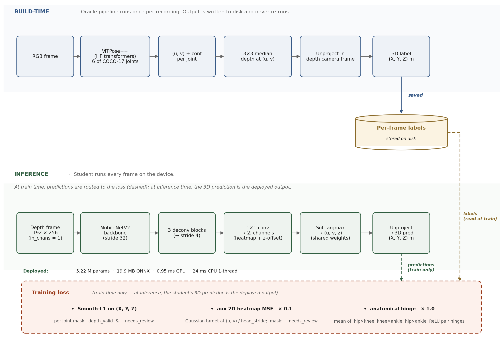
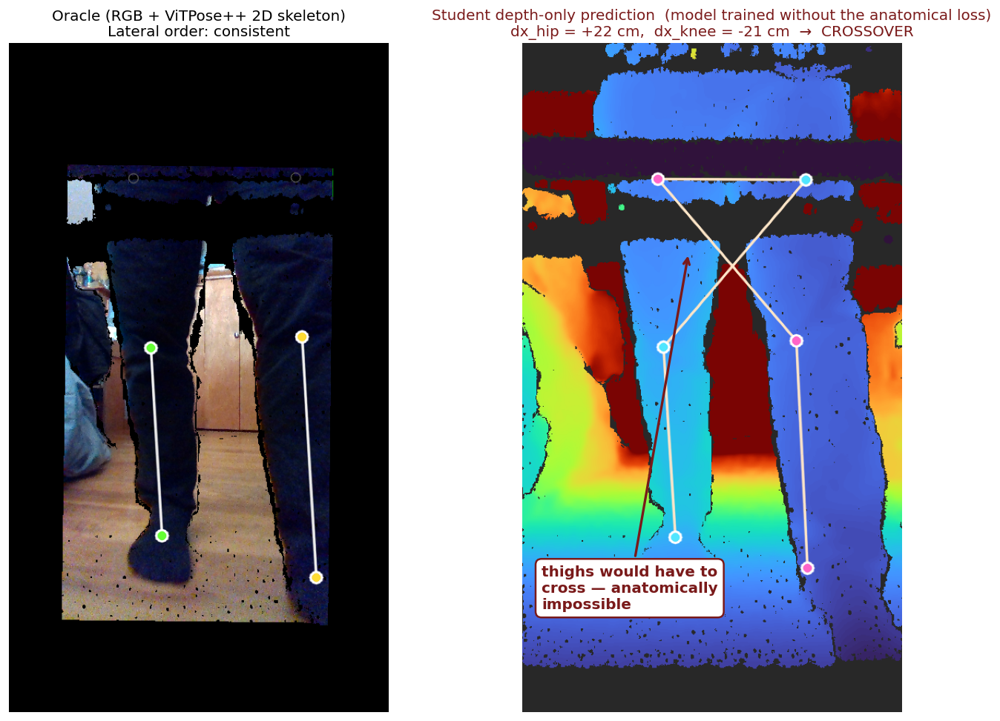
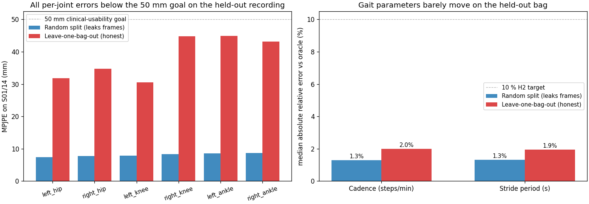

# depthpose: a 5 MB depth-only model for 3D lower-body pose tracking on a walker

*6.8300 Computer Vision Final Project — Spring 2026 — Jung Yeop (Steve) Kim*

*One frame from `rs_up_incline.bag`, a recording fully held out from training. **Left:** ViTPose++ on RGB produces 2D keypoints, which we lift to 3D using the depth pixel at each location. **Right:** the depth-only student — which has never seen this recording — recovers the same six 3D keypoints from depth alone in 0.95 ms on an RTX A5000 (5–10 ms projected on a Jetson Xavier NX).*

## Abstract

A 5.22 M-parameter depth-only student trained against an RGB ViTPose++ oracle reproduces the oracle's lower-body 3D pose to within 39.6 mm mean per-joint position error (MPJPE) on a walker recording the model has never seen (95 % bootstrap CI [37.7, 41.3] mm over n = 401 frames), while preserving cadence and stride period within 2 % of the oracle. The model fits in 19.9 MB of ONNX, runs in 0.95 ms on an RTX A5000 with ONNX Runtime CUDA, and projects to 5–10 ms on a Jetson Xavier NX with TensorRT FP16, roughly 10× faster than the 125 M-parameter RGB oracle on the same edge silicon. The result is depth-only lower-body pose tracking that is small, fast, privacy-preserving, and accurate enough to recover clinically relevant gait parameters on data the model has never observed.

## Novelty, contributions, and hypotheses

We test three hypotheses; the contributions below are organised around them.

1. **(H1, accuracy) High accuracy on a recording the model has never seen.** On leave-one-bag-out: 39.6 mm MPJPE (95 % CI [37.7, 41.3] mm) on a held-out walker session, under our 50 mm clinical-usability threshold; cadence and stride period stay within 2 % of the oracle.
2. **(H2, geometric prior) A geometric prior that teaches the model anatomical consistency.** A closed-form hinge loss penalises frames where the left/right lateral order of the hips disagrees with that of the knees or ankles. It cuts physically impossible crossover predictions by 3.8× in-distribution and produces zero crossovers on the 401 held-out frames, at no MPJPE cost.
3. **(H3, deployment) A lightweight depth-only training recipe optimised for edge hardware, using an RGB pose tracker as the label source.** Pseudo-labels from a pretrained RGB ViT remove the need for hand-annotated 3D ground truth; the student (5.22 M params, 19.9 MB ONNX) runs in 5–10 ms on a Jetson Xavier NX with TRT FP16 — roughly 10× faster than the RGB oracle on the same edge silicon.

## Why depth-only on a walker

An Intel RealSense D435i is bolted vertically to a walker frame, looking down at the user's legs from roughly knee height. The deliverable is a model that extracts clinically useful gait parameters (cadence, stride length, keypoint locations) from depth alone, so the device can be deployed without recording or transmitting RGB.

This work builds on a predecessor, the Careway Walker [^careway], an actuated walker designed to improve stability for elderly and mobility-limited users. Earlier Careway builds used an RGB pose tracker to find 2D keypoints, then read depth at those pixels to recover 3D positions. That pipeline works, but pays for the RGB camera at every inference in bandwidth, storage, latency, model size, and the privacy cost of streaming color video out of the home. The natural next question: is the same clinical signal recoverable from depth alone?

The privacy stakes are not theoretical. Walker users skew older — the population most resistant to in-home video monitoring [^demiris] [^beach] — and depth- and skeleton-based representations have become a standard mitigation in the assisted-living literature, since they strip the identifying texture and colour [^padilla]. The walker follows the user everywhere (kitchen, bathroom doorway, bedroom), often in sleepwear and around personal background scenes; depth alone discards all of that identifying information.

A depth-only model also opens a deployment regime the RGB oracle does not reach. ViTPose++ at 125 M parameters needs a substantial GPU to run in real time; a depth-only MobileNetV2 at 5 M parameters runs single-threaded on a CPU, making battery-powered embedded deployment feasible.

The dataset is 14 short walker recordings of one subject covering kitchen loops, gravel driveways, bumpy stones, and inclines — about 4 minutes of walking, ~7,100 frames at 30 fps. One recording (`rs_up_incline.bag`) is held out from training entirely as the generalization test.

## Related work and the gap this work addresses

Three lines of work intersect this project. **RGB pose estimation** has been driven to high accuracy by ViT-based methods like ViTPose [^vitpose] and to mobile deployability by lightweight CNN architectures like BlazePose [^blazepose], MoveNet [^movenet], and RTMPose [^rtmpose]; we use the 125 M-parameter `vitpose-plus-base` checkpoint as our oracle. RGB inference at any scale, however, inherits the modality's limitations: sensitivity to lighting and clothing-color variation, inability to recover metric depth without an additional sensor, and the privacy cost discussed above [^padilla]. **Depth-only 3D pose estimation** has a smaller literature: A2J [^a2j] regresses 3D joint positions from a single depth image; V2V-PoseNet [^v2v] performs voxel-to-voxel prediction in a 3D grid. Both target Kinect-style indoor or tabletop settings at much larger footprints than ours, and neither addresses walker-mounted depth video of lower-body gait. **Walker-mounted gait analysis** has its own published line of work: Hu et al. [^hu] track 3D lower-limb pose with a structured-light camera on a moving walker via particle-filter tracking; Page et al. [^page] perform embedded depth-camera feet-pose estimation on the ASBGo smart walker; Palermo et al. [^palermo] — the closest precedent to ours — train a CNN-based pose estimator on smart-walker RGB-D video. Most of these prototypes are too bulky for everyday use, and none publish trained weights or training code.

The contribution here is the combination. We use a 125 M-parameter pretrained RGB ViT as an offline pseudo-label oracle to train a 5 M-parameter depth-only student. Standard tools fill in around this gap: MobileNetV2 [^mbv2] as the student backbone (single-channel via summed RGB conv weights), a 2.5D heatmap-plus-depth-offset head with soft-argmax from the integral-pose family [^integral], teacher–student distillation [^hinton] [^okdhp] through pseudo-labels (offline; the oracle does not co-train), anatomical/kinematic loss families [^anatomy_accv] [^anatomy_arxiv], and TensorRT [^trt] for Jetson deployment. We add a domain-specific lateral-consistency hinge — penalising left/right disagreements in the lateral order of hip/knee/ankle pairs — and combine these tools to produce a depth-only walker-gait model whose held-out performance, to our knowledge, has not been reported in this configuration.

## Data: 14 walker recordings and three preprocessing decisions

*Oracle (build-time, once per recording): RGB → ViTPose++ → median-depth lookup → unproject; per-frame labels saved to disk. Student (inference, every frame on the device): depth → MobileNetV2 → soft-argmax → unproject. Training loss combines a per-joint-masked 3D Smooth-L1, a 2D heatmap MSE auxiliary, and a left/right anatomical-consistency hinge.*

The oracle runs ViTPose++ on the RGB stream, looks up depth at each detected 2D keypoint pixel — color is warped onto the depth camera's grid at extraction so (u, v) directly indexes the depth frame — and unprojects to (X, Y, Z) in metres. Three preprocessing decisions had to be made before this produced usable training data.

**The 90° rotation.** The RealSense was mounted with its native "up" rotated 90° clockwise relative to the world, so raw frames are sideways. Every recording gets a 270° clockwise correction at extraction time, baked into saved frames and intrinsics so downstream code is unaffected.

**The hip in the depth-FOV gap.** After color-to-depth alignment and rotation, the top of every frame has a black "no depth" border because the color camera sees higher than the depth camera. The hips often land in this band — ViTPose finds the hip in color while depth at that pixel reads zero. We flag those rows as `depth_valid = False`, write NaN for (X, Y, Z), and never extrapolate. A fabricated hip-z would bias every downstream knee-flexion derivation; the pipeline should be honest about what it doesn't know.

**Per-joint masking, not whole-frame filtering.** Across the full 14-recording dataset, only **15.6 %** of frames have all six joints with valid depth, but **99.6 % have valid knees and ankles**. The training loss masks per joint, so a frame with an invalid hip still contributes a 4-joint loss from its valid knees and ankles; the same masking applies to evaluation MPJPE. Filtering by "all six joints valid" would have discarded **84 % of usable frames** for a single missing joint that the gait derivations either do not need (cadence is ankle-only) or can skip per-frame (knee flexion needs the hip).

A note on what these labels represent. We have no motion-capture ground truth, so MPJPE measures agreement with the ViTPose++ oracle, not absolute joint accuracy. The exact pixel for a "joint" is itself an annotator convention; a 20–40 mm fuzziness across reasonable conventions sets a floor on what MPJPE can mean here.

## Student model

A `mobilenetv2_100` backbone with `in_chans=1` (`features_only=True`, `out_indices=(4,)` from `timm`) produces a stride-32 feature map with 320 channels. Three transposed-convolution blocks bring it back to stride 4 (each: 4×4 deconv stride 2 → BatchNorm → ReLU; channels 320 → 256 → 256 → 256), then a 1×1 conv produces 2J channels: J for heatmap logits and J for per-pixel z-offsets. Soft-argmax (β = 100) over the heatmaps yields subpixel (u, v) in heatmap-pixel coordinates; the *same* softmax weights aggregate the per-pixel z map into a single scalar z per joint. (u, v) is rescaled by `head_stride = 4`, then unprojection with per-sample input intrinsics gives (X, Y, Z) in metres. Total: 5.22 M params, 1.36 GMACs at 192×256 input, 19.9 MB ONNX.

## The iteration story: run1 → run4

We trained four models in sequence; each was driven by what the previous one revealed.

*Adding a hinge term that penalises any frame where the predicted left-hip-vs-right-hip lateral order disagrees with the knee or ankle order cuts the rate of physically-impossible crossover predictions by 3.8×, with no MPJPE cost.*

**Run 1 — no-prior baseline (3D Smooth-L1 only).** 200 epochs, AdamW with lr 1e-3, cosine schedule, weight decay 1e-4, on a random 80/20 per-session split. MPJPE on the test split: 22.5 mm; 36 minutes on an RTX A5000. The baseline against which H2 is tested.

**Run 2 — auxiliary 2D heatmap loss.** Adding a Gaussian-target MSE on the 2D heatmaps with weight 0.1, and cutting the schedule to 100 epochs. MPJPE: 22.5 mm in half the wall time. The aux loss didn't improve final accuracy but more than halved iteration cost; we kept the 100-epoch schedule from here on.

**Inspecting the predictions.** After Run 2 we rendered the oracle/student videos for all 14 sessions and reviewed them visually. A subtle artifact emerged: in some frames the Run-1 baseline placed the left hip on the right of the right hip while keeping the knees on their correct sides — anatomically impossible, since the thighs would have to cross. Across all 7,112 frames: 38 (0.53 %) had a hip-vs-knee lateral-order disagreement; 49 (0.69 %) showed some L/R inconsistency. Rare in absolute terms, but a physically impossible output undermines clinical credibility.

*One of those 38 frames, S01/1 frame 288. Left: oracle on RGB, lateral order correct. Right: the student without the anatomical loss predicts the hip pair `+22 cm` apart (left hip on the left) and the knee pair `−21 cm` apart (left knee on the right) — visible in the depth panel as an "X" of skeleton lines instead of two parallel chains.*

**Run 3 — anatomical-consistency loss (the geometric prior).** Define `dx_pair = x_left - x_right` for each joint pair. For any two pairs (hips and knees, hips and ankles, knees and ankles), `sign(dx_a) == sign(dx_b)` should hold for any standing or walking pose. The hinge `relu(-dx_a · dx_b)` is zero on consistent frames and equals `|dx_a · dx_b|` on crossover frames. We added it to the training loss with weight 1.0. After 100 epochs, hip-knee crossover dropped from 38 / 7,112 (0.53 %) to 10 / 7,112 (0.14 %) — a 3.8× reduction; all-pair crossover went from 0.69 % to 0.25 %. MPJPE *improved* slightly, from 22.5 mm to 21.9 mm. The constraint cost nothing because it only fired on frames that were already wrong. Ten residual crossover frames remain: a soft hinge can't strictly enforce the constraint when other loss terms pull in different directions.

That should have concluded the iteration. A re-examination of the split changed the picture.

**Re-examining the train/test split.** At 30 fps, adjacent frames are nearly identical. A frame-level random split places near-duplicates of every test frame into training, letting the model memorize per-recording content rather than generalize. The 21.9 mm MPJPE was a memorization number; leave-one-recording-out is needed to measure how the model behaves on a bag it has never seen.

**Run 4 — leave-one-bag-out (the H1 test).** Every frame of S01/1 through S01/13 to train (6,711 frames), every frame of S01/14 (`rs_up_incline.bag`) to test (401 frames). Same architecture, loss, hyperparameters, 19-minute wall time. The honest MPJPE on the held-out bag: 39.6 mm, 95 % bootstrap CI [37.7, 41.3] mm (5,000 frame-level resamples).

*Same model, same session, scored differently depending on whether that session contributed frames to training. Blue: random per-session split (S01/14 frames in both train and test). Red: leave-one-bag-out (S01/14 truly held out). On the honest evaluation, every per-joint error stays under the 50 mm clinical-usability goal, and the right panel shows the clinically meaningful gait outputs (cadence and stride period) barely move.*

The honest held-out MPJPE of 39.6 mm sits under the 50 mm clinical-usability threshold, despite the model never seeing this recording. Cadence relative error: 2.0 %; stride period: 1.9 %. Hip-knee crossover: 0.00 % — the anatomical hinge generalised cleanly to an unseen recording. **H1 is supported.** The 8.2 mm number from running the random-split-trained model on S01/14 was a memorization artifact (most of those 401 frames were in its training set); the leave-one-bag-out 39.6 mm is the honest number.

## Side-by-side: oracle and student in action

<figure class="video-grid">

<video controls preload="metadata" muted loop playsinline>
<source src="videos/S01_7.mp4" type="video/mp4">
</video>

Best case: <code>rs_blue_car_light_change</code> MPJPE vs oracle: 9 mm (random split)

<video controls preload="metadata" muted loop playsinline>
<source src="videos/S01_14_holdout.mp4" type="video/mp4">
</video>

Held-out: <code>rs_up_incline</code> (S01/14) MPJPE vs oracle: 40 mm (never seen during training)

</figure>

*Oracle (green skeleton on RGB) on the left of each panel, student (cyan/magenta on depth) on the right. The live HUD shows cadence and stride period per side from ankle-z peak detection — the oracle's reads parquet labels, the student's its own output, and the two converge as the clip plays.*

What matters here is the right-hand recording: the student has never seen `rs_up_incline.bag`, yet the legs are visually well-tracked throughout, and the depth-panel HUD converges to the oracle's RGB-panel HUD within a few seconds. The in-distribution clip on the left is the reference for near-perfect tracking under the random split; the deployment claim rests entirely on the held-out side.

## Deployment: latency on the same edge silicon as the oracle

*Measured + projected latency for the 125 M-param ViTPose++ oracle and the 5.2 M-param depth-only student. On the same RTX A5000 the student is 7–8× faster (0.95 ms ORT-CUDA fp32 vs 7.9 ms PyTorch fp32 model-only). Projected to Jetson Xavier NX with TRT FP16: oracle 50–100 ms (over the 30 fps budget), student 5–10 ms. Hatched bars are projections via spec-ratio scaling against the workstation.*

On the workstation, the student exports to ONNX (19.9 MB) and runs in 0.95 ms under ONNX Runtime CUDA, or 24 ms single-thread CPU — both under the 33 ms / 30 fps budget. The oracle runs in 7.9 ms PyTorch CUDA fp32 model-only (12.8 ms full pipeline), 7–8× slower than the student.

The deployment-target comparison is more meaningful. Jetson Xavier NX has ~1/20th the fp32 GPU throughput of an A5000. Naive scaling puts the student at ~20 ms fp32; TRT FP16 drops it to 5–10 ms. The oracle ViT incurs two compounding costs: the 8× workstation gap, plus ViT attention being harder to accelerate on Jetson than depthwise-convolution MobileNet (TRT FP16 typically yields 2–3× for ViT vs 4–5× for CNNs). The oracle projection on Jetson NX with TRT FP16 is 50–100 ms — 1.5–3× over the 33 ms budget; INT8 quantisation with calibration would be required to fit.

On the same edge hardware, the student is roughly 10× faster than the oracle, fits in 19.9 MB versus the oracle's ~250 MB at FP16, and does not require RGB. Only the student fits the latency budget; the oracle's role is offline pseudo-labelling. **H3 is supported.**

## Conclusion: limitations and transferable insights

Three honest limitations.

**Single subject and limited environments.** The dataset is one individual walking, so cross-subject generalization, different clothing, and significantly different environments are untested. The held-out bag is the same subject in a new walking context — a useful generalization signal but a weaker one than cross-subject evaluation.

**No temporal or physics model.** The student is per-frame; adjacent-frame information is unused. A small temporal head (e.g., a 1D conv over a 5-frame window) would likely improve per-frame MPJPE within the parameter budget. Per-session physical constraints (e.g., constant leg length within one walk) could similarly be added as a session-level prior, in the same spirit as the lateral hinge.

**No failure detection.** The model assumes a human lower torso in frame at all times. Detection, segmentation, and abstention on out-of-distribution inputs would be required for actual deployment.

**The dataset is the binding constraint, not the architecture.** A 14-recording, single-subject pilot already produces clinically usable gait parameters on a fully held-out walking session in 19 minutes of training time. The conditions under which the model breaks — different mounts, lighting, clothing, camera-to-subject distances — are dataset-coverage gaps, not architectural ones. Scaling along those axes (5–10 more subjects, varied clothing, indoor/outdoor backgrounds, a small set of mount geometries) is incremental engineering, not new research. Given how cleanly per-frame errors degrade *while gait parameters remain stable* in this pilot, a wider dataset should push held-out MPJPE comfortably below 25 mm without architectural change.

[^vitpose]: Yufei Xu, Jing Zhang, Qiming Zhang, and Dacheng Tao. *ViTPose: Simple Vision Transformer Baselines for Human Pose Estimation*. NeurIPS 2022. Subsequent work: *ViTPose++: Vision Transformer for Generic Body Pose Estimation*, IEEE TPAMI 46(2):1212–1230, 2024. We use the `usyd-community/vitpose-plus-base` checkpoint via Hugging Face Transformers.
[^rtmpose]: Tao Jiang, Peng Lu, Li Zhang, Ningsheng Ma, Rui Han, Chengqi Lyu, Yining Li, and Kai Chen. *RTMPose: Real-Time Multi-Person Pose Estimation based on MMPose*. arXiv:2303.07399, 2023.
[^blazepose]: Valentin Bazarevsky, Ivan Grishchenko, Karthik Raveendran, Tyler Zhu, Fan Zhang, Matthias Grundmann. *BlazePose: On-device Real-time Body Pose tracking*. CVPR 2020 Workshop on Computer Vision for AR/VR (CV4ARVR). arXiv:2006.10204.
[^movenet]: Google. *MoveNet: Ultra fast and accurate pose detection model*. TensorFlow Hub, 2021. https://www.tensorflow.org/hub/tutorials/movenet
[^mbv2]: Mark Sandler, Andrew Howard, Menglong Zhu, Andrey Zhmoginov, Liang-Chieh Chen. *MobileNetV2: Inverted Residuals and Linear Bottlenecks*. CVPR 2018. We use the `mobilenetv2_100` variant from the `timm` library.
[^hinton]: Geoffrey Hinton, Oriol Vinyals, Jeff Dean. *Distilling the Knowledge in a Neural Network*. NIPS 2014 Deep Learning Workshop. arXiv:1503.02531.
[^okdhp]: Zheng Li, Jingwen Ye, Mingli Song, Ying Huang, Zhigeng Pan. *Online Knowledge Distillation for Efficient Pose Estimation*. ICCV 2021.
[^integral]: Xiao Sun, Bin Xiao, Fangyin Wei, Shuang Liang, Yichen Wei. *Integral Human Pose Regression*. ECCV 2018. The 2.5D head with soft-argmax aggregation follows this formulation.
[^a2j]: Fu Xiong, Boshen Zhang, Yang Xiao, Zhiguo Cao, Taidong Yu, Joey Tianyi Zhou, Junsong Yuan. *A2J: Anchor-to-Joint Regression Network for 3D Articulated Pose Estimation from a Single Depth Image*. ICCV 2019. Evaluates on both hand datasets and the ITOP body-pose dataset.
[^v2v]: Gyeongsik Moon, Ju Yong Chang, Kyoung Mu Lee. *V2V-PoseNet: Voxel-to-Voxel Prediction Network for Accurate 3D Hand and Human Pose Estimation from a Single Depth Map*. CVPR 2018.
[^anatomy_accv]: Xin Cao, Xu Zhao. *Anatomy and Geometry Constrained One-Stage Framework for 3D Human Pose Estimation*. ACCV 2020. Introduces bone-length and bone-symmetry losses on a kinematic-tree pose representation.
[^anatomy_arxiv]: Tianlang Chen, Chen Fang, Xiaohui Shen, Yiheng Zhu, Zhili Chen, Jiebo Luo. *Anatomy-aware 3D Human Pose Estimation with Bone-based Pose Decomposition*. IEEE Transactions on Circuits and Systems for Video Technology (TCSVT), 2021. arXiv:2002.10322.
[^hu]: Richard Zhi-Ling Hu, Adam Hartfiel, James Tung, Adel Fakih, Jesse Hoey, Pascal Poupart. *3D Pose Tracking of Walker Users' Lower Limb with a Structured-Light Camera on a Moving Platform*. IEEE CVPR Workshops 2011, pp. 29–36.
[^page]: S. Page, M. Martins, L. Saint-Bauzel, C. Santos, V. Pasqui. *Fast embedded feet pose estimation based on a depth camera for smart walker*. IEEE ICRA 2015, pp. 4224–4229.
[^palermo]: Manuel Palermo, Sara Moccia, Lucia Migliorelli, Emanuele Frontoni, Cristina P. Santos. *Real-time human pose estimation on a smart walker using convolutional neural networks*. Expert Systems with Applications, vol. 184, art. 115498, 2021. arXiv:2106.14739.
[^trt]: NVIDIA. *TensorRT Best Practices Guide*. NVIDIA Developer Documentation. https://docs.nvidia.com/deeplearning/tensorrt/latest/performance/best-practices.html
[^careway]: Jung Yeop Kim et al. *The Careway Walker: An Actuated Walker with Gait Analysis and Pose Correction*. Undergraduate honors thesis. Available at https://www.jungyeop.com/args. The predecessor project this work builds on; earlier Careway builds used an RGB pose tracker plus depth lookup, which this depth-only student replaces.
[^demiris]: George Demiris, Brian K. Hensel, Marjorie Skubic, Marilyn Rantz. *Senior residents' perceived need of and preferences for "smart home" sensor technologies*. International Journal of Technology Assessment in Health Care, 24(1):120–124, 2008.
[^beach]: Scott R. Beach, Richard Schulz, Julie Downs, Judith T. Matthews, Bruce Barron, Katherine Seelman. *Disability, Age, and Informational Privacy Attitudes in Quality of Life Technology Applications: Results from a National Web Survey*. ACM Transactions on Accessible Computing, 2(1), Article 5, 21 pages, May 2009.
[^padilla]: José Ramón Padilla-López, Alexandros André Chaaraoui, Francisco Flórez-Revuelta. *Visual privacy protection methods: A survey*. Expert Systems with Applications, 42(9):4177–4195, 2015.
